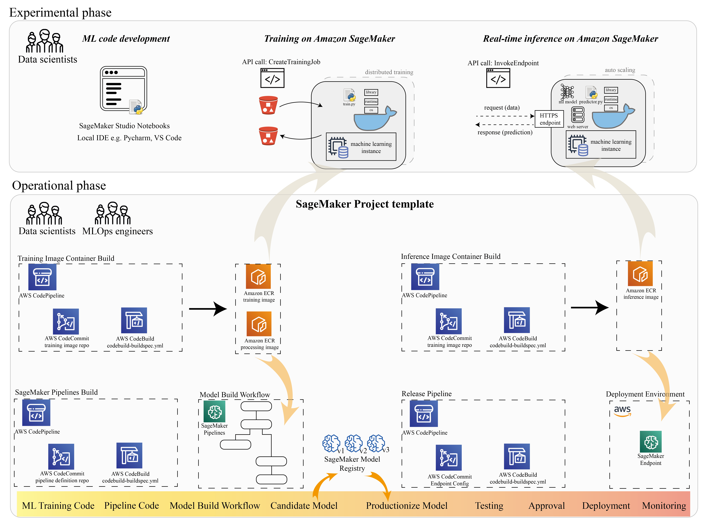

##  train-and-deploy-ocr-model-on-amazon-sagemaker

**Onboard PaddleOCR with SageMaker Projects for MLOps, illustration with optical character recognition on identity documents**

# Quick Start 

Run train_and_deploy/notebook.ipynb on Amazon SageMaker Notebook Instances

Or follow step-by-step guidance on Amazon SageMaker Studio Notebooks with our blog post (to be annoucned)

# Code Structure

* experiments-sagemaker-studio (SageMaker training and deployment SDK)
* image-build-train 
* image-build-deploy
* sagemaker-pipeline-workflow

## Features

## Security

See [CONTRIBUTING](CONTRIBUTING.md#security-issue-notifications) for more information.

## License

This library is licensed under the MIT-0 License. See the LICENSE file.

